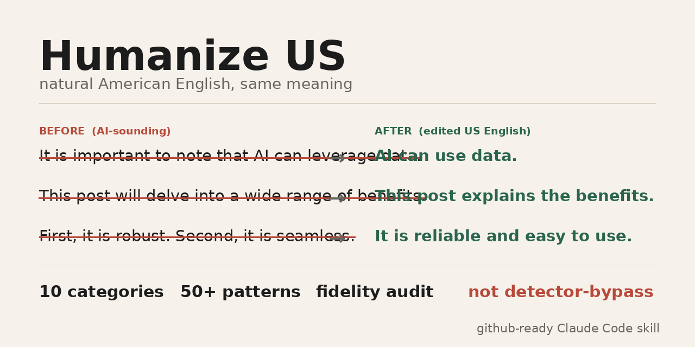

<p align="center">
  
</p>

# Humanize US — Natural American English Rewrite Harness v0.1

Humanize US is a Claude Code skill that turns **AI-sounding English drafts** into **clean, natural US English** while preserving meaning. It targets the patterns LLMs over-produce in English: stock phrases, templated essay structure, over-polished cadence, generic abstraction, modal hedging, passive and nominalized prose, punctuation tics, and uniformly smooth rhythm.

This is **not** an "undetectable AI" tool. It does not promise detector evasion and should not be used to hide authorship where disclosure is required. The goal is editorial: better readability, more natural cadence, and tighter prose backed by a strict fidelity audit.

Inspired by [epoko77-ai/im-not-ai](https://github.com/epoko77-ai/im-not-ai).

## Why English needs its own taxonomy

English LLM writing tends to sound "AI-ish" for recognizable reasons. It leans on words like *delve*, *comprehensive*, *crucial*, and *transformative*; announces structure with "first/second/third"; overuses meta-phrases like "it is important to note"; and produces paragraphs that are smooth but strangely even. Recent work in AI-text forensics and stylometry treats lexical, grammatical, syntactic, punctuation, and variability features as useful signals — while also warning that detector accuracy is unstable across domains and paraphrasing. See [`research-foundation.md`](.claude/skills/humanize-english-us/references/research-foundation.md).

## Four non-negotiables

1. **Fidelity first** — facts, claims, numbers, names, dates, quotes, citations, and legal/scientific wording stay intact.
2. **Span-grounded editing** — every edit must connect to a detected pattern. No full rewrite just because the prose could be "better."
3. **Genre match** — a business memo stays a memo; an academic paragraph stays academic; an op-ed stays an op-ed.
4. **No over-polish** — changed-text ratio above 30% triggers review; above 50% triggers rollback or human review.

## Architecture

**Fast mode** is the default for inputs under about 5,000 words.

```text
input text
  ↓
[humanize-monolith]  detect → rewrite → self-check in one pass
  ↓
final.md + summary.md
```

**Strict mode** is used for long, high-risk, or user-requested precision runs.

```text
input text
  ↓
[ai-tell-detector]         span-level findings
  ↓
[english-style-rewriter]   localized edits only
  ↓
[parallel review]
  ├─ [content-fidelity-auditor]  semantic equivalence audit
  └─ [naturalness-reviewer]      residual AI-sounding cues + over-polish audit
  ↓
accept | rewrite_round_2 | rollback_and_rewrite | hold_and_report
```

## Agent set

| Agent | Mode | Role |
|---|---:|---|
| `humanize-monolith` | Fast | One-pass detection, rewrite, and self-check |
| `ai-tell-detector` | Strict | Span-level AI-sounding pattern detector |
| `english-style-rewriter` | Strict | Surgical US-English rewrite from findings |
| `content-fidelity-auditor` | Strict | Checks that meaning, facts, and citations survived |
| `naturalness-reviewer` | Strict | Checks residual tells and over-polishing |
| `english-ai-tell-taxonomist` | Maintenance | Updates the taxonomy as new patterns appear |
| `humanize-web-architect` | Optional | Designs a web version when requested |

## US English AI-sounding taxonomy

| ID | Category | Typical patterns |
|---|---|---|
| A | Meta-disclaimers and throat-clearing | "As an AI…," "It is important to note," "In today's digital age" |
| B | Stock LLM vocabulary | delve, nuanced, robust, seamless, transformative, pivotal, unlock, leverage |
| C | Mechanical structure | first/second/third, generic intro/body/conclusion, listicle cadence |
| D | Generic abstraction | "various stakeholders," "numerous benefits," "wide range of applications" |
| E | Rhythm uniformity | similar sentence lengths, smooth but flat paragraphs, no friction or emphasis |
| F | Over-hedging | "may potentially be able to," "could possibly help," "it seems likely that" |
| G | Passive and nominalized prose | "the implementation of," "is characterized by," "was conducted by" |
| H | Connector overuse | moreover, furthermore, consequently, ultimately, therefore at every turn |
| I | Punctuation and formatting tells | em-dash habit, colon subtitles, excessive bold, emoji/checkmark bullets |
| J | Over-balanced rhetoric | "not only…but also," mirrored pairs, three-part symmetrical lists |

Full rules: [`ai-tell-taxonomy.md`](.claude/skills/humanize-english-us/references/ai-tell-taxonomy.md) and [`rewriting-playbook.md`](.claude/skills/humanize-english-us/references/rewriting-playbook.md).

## Usage

### 1. Start Claude Code inside this repo

```bash
claude
```

### 2. Ask naturally

```text
Make this sound like natural US English without changing the meaning:

[paste AI-sounding draft]
```

Trigger phrases include:

```text
humanize this
make this sound less AI-written
rewrite in natural American English
remove generic AI tone
make it read like a human-edited draft
```

### 3. Or use the slash command

```text
/humanize path/to/draft.md
/humanize "your pasted text" genre: business memo intensity: conservative
```

Options:

| Option | Values | Default |
|---|---|---|
| `genre` | `business`, `academic`, `blog`, `op-ed`, `email`, `web-copy`, `public` | auto |
| `intensity` | `conservative`, `standard`, `assertive` | standard |
| `min_severity` | `S1`, `S2`, `S3` | S2 |
| `mode` | `fast`, `strict` | auto |

### 4. Review outputs

Each run creates `_workspace/{YYYY-MM-DD-NNN}/`.

| File | Meaning |
|---|---|
| `01_input.txt` | Original input |
| `02_detection.json` | Strict-mode span findings |
| `03_rewrite.md` | Strict-mode rewrite |
| `04_fidelity_audit.json` | Meaning-preservation audit |
| `05_naturalness_review.json` | Residual tells and over-polish review |
| `final.md` | Final edited version |
| `summary.md` | Scores, edits, grade, caveats |

### 5. Iterate

```text
/humanize-redo make it less casual
/humanize-redo only fix the intro
/humanize-redo keep the headings but remove the stock phrases
```

## Optional local scanner

The included script gives a quick, non-ML diagnostic. It does not classify authorship; it just reports surface cues.

```bash
python scripts/us_english_scan.py draft.md
python scripts/us_english_scan.py draft.md --json
```

Metrics include stock phrase density, front-loaded connector rate, sentence-length variation, bullet/heading density, passive markers, nominalization density, and em-dash frequency.

## Do-not-edit list

Never rewrite these unless the user explicitly asks:

- Numbers, units, dates, percentages, prices, and equations
- Proper names, product names, model names, organization names
- Direct quotes and quoted source titles
- Citations, URLs, DOIs, statute names, section numbers
- Domain terms that are correct in context
- Required legal, medical, financial, or academic wording

## Responsible-use note

AI-detection research consistently shows fragility under domain shift, paraphrasing, and human/AI co-editing. This project therefore treats "AI tells" as **editing cues**, not truth claims about authorship. For schools, employers, publishers, courts, and regulated contexts, follow the applicable disclosure policy.
